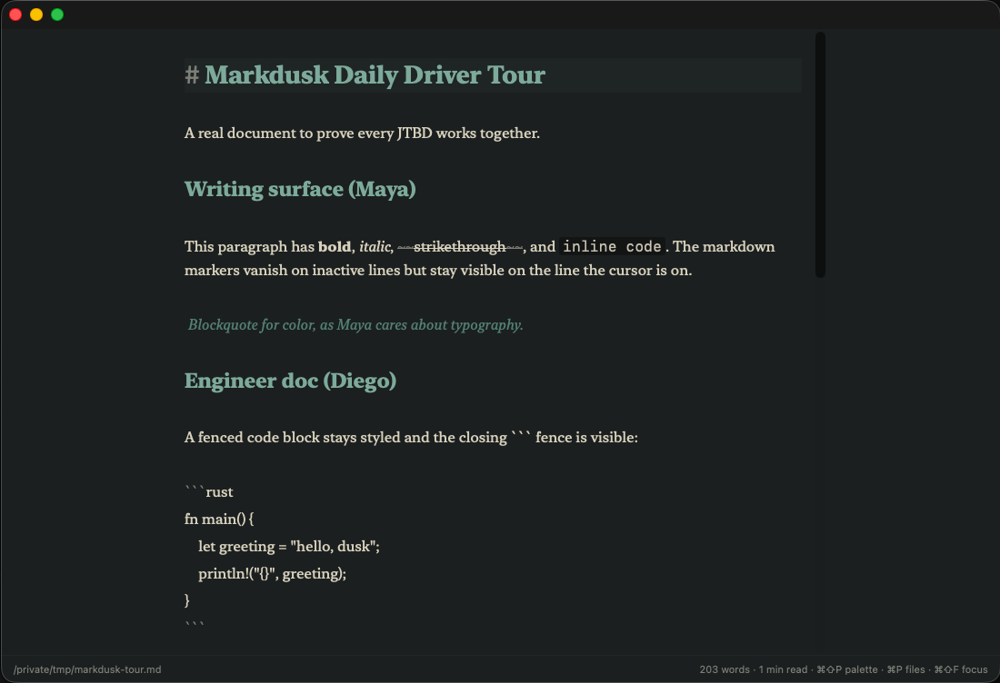
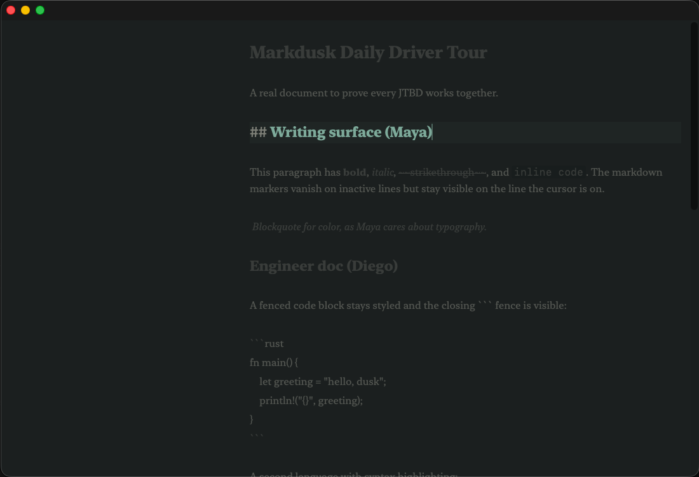
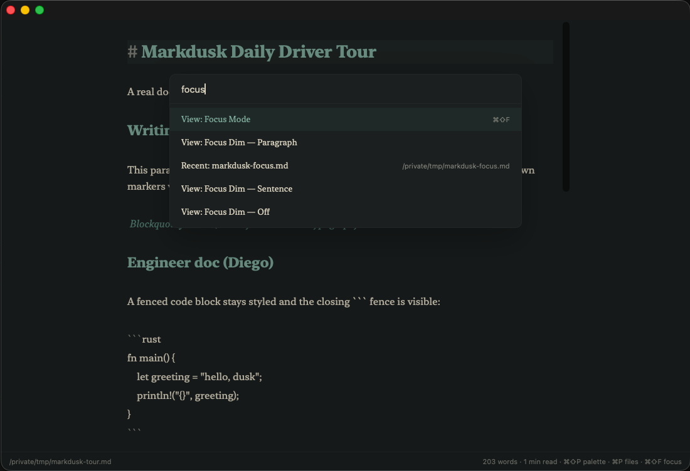

# Markdusk

A Mac-native markdown editor. Tauri shell, Rust core, Svelte UI, CodeMirror 6 editor.
Free, no account, no cloud, no plugins.

Built because the default `.md` experience on macOS is TextEdit showing raw
asterisks, and the alternatives are either paid (Bear, iA Writer, Typora) or
ask you to adopt a knowledge-management religion (Obsidian). Markdusk just
opens the file.



## What it does

- **Soft WYSIWYG.** Markdown markers hide on inactive lines, stay visible on the line your cursor is on.
- **Tabs** with autosave per file.
- **Workspace sidebar** + click-to-jump outline.
- **Command palette** (⌘⇧P) and quick file switcher (⌘P) with fuzzy search.
- **Jump to heading** (⌘⇧G).
- **Recent files** that survive restart, plus tab-session restore on launch.
- **Focus mode** (⌘⇧F) with iA-style paragraph dim and typewriter scroll.
- **Smart punctuation** — curly quotes, en/em-dashes, ellipsis. Off by default.
- **Bracket auto-pair** and **smart list continuation**.
- **Find & Replace** with regex.
- **Spell-check** toggle.
- **Vim mode** toggle.
- **Themes** — Smoke (sage) and Amber (paper), each with light/dark/system appearance.
- **Inline KaTeX** math and **Mermaid** diagrams in the editing buffer.
- **Syntax highlighting** for ~25 languages in fenced code blocks.
- **Export** to HTML, PDF (via WebView print), and DOCX (via [`pandoc`](https://pandoc.org/) sidecar). Copy as Rich Text for paste-into-Slack/Mail.
- **Image paste** saves alongside the doc and inserts a relative reference.
- **Sticky heading** while scrolling through long docs.
- **Line numbers** toggle.





## What it isn't

It's not Obsidian. There's no graph view, no plugin marketplace, no backlinks,
no daily-notes ritual, no canvas. It's not a knowledge base. It's not a
publishing CMS. It's not real-time collaborative. It's not cross-platform yet
(Mac-only on purpose). It's not AI-first — no inline ghost-text completions.

See [`docs/personas.md`](docs/personas.md) for who it's for and
[`docs/roadmap.md`](docs/roadmap.md) for what's next.

## Install

Releases will land on Homebrew when the build pipeline is signed and
notarized. Until then, build from source:

```bash
git clone https://github.com/Chartres/markdusk.git
cd markdusk
pnpm install
pnpm tauri build
# bundle ends up in target/release/bundle/macos/Markdusk.app
```

Requires Node 20+, pnpm, Rust 1.90+, Xcode Command Line Tools. macOS 12+.

DOCX export requires pandoc on `PATH`:

```bash
brew install pandoc
```

## Status

Pre-release. The owner is using it as his default `.md` editor and shipping
fixes as friction shows up. The roadmap (`docs/roadmap.md`) tracks what's
shipped vs. what's queued — currently most of M1, M2, and parts of M3.

If you try it and something breaks, file an issue with the file that
broke it and a screenshot.

## Stack

- [Tauri 2](https://tauri.app/) shell — Rust binary, WebKit WebView, native menus.
- [Svelte 5](https://svelte.dev/) with runes for the UI layer.
- [CodeMirror 6](https://codemirror.net/) editor with custom soft-WYSIWYG decorations.
- [`pulldown-cmark`](https://github.com/raphlinus/pulldown-cmark) for markdown parsing in the Rust core.

## License

MIT — see [`LICENSE`](LICENSE).
