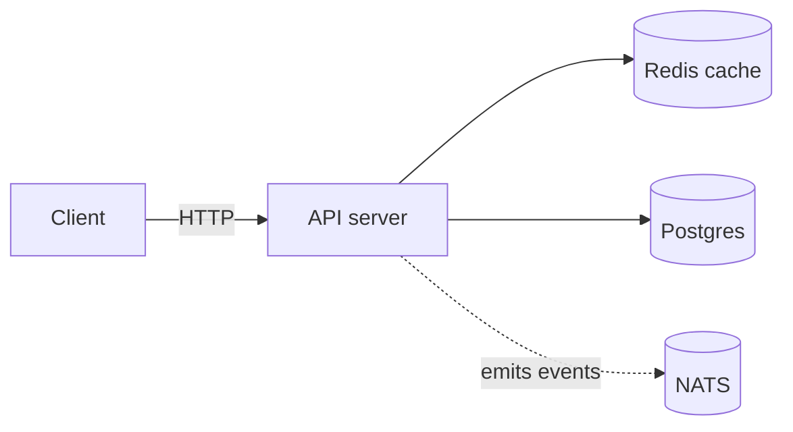

# widget-service

A small HTTP service that takes widgets and returns slightly better widgets.

## Quick start

```bash
git clone https://github.com/example/widget-service
cd widget-service
cargo run
```

The service binds to `127.0.0.1:8080` by default. Override with `WIDGET_PORT`.

## Endpoints

| Method | Path           | Purpose                      |
|--------|----------------|------------------------------|
| GET    | `/health`      | Returns `200 ok`             |
| POST   | `/widgets`     | Create a widget              |
| GET    | `/widgets/:id` | Fetch a widget by id         |
| PATCH  | `/widgets/:id` | Update fields on a widget    |
| DELETE | `/widgets/:id` | Soft-delete a widget         |

## Architecture



## Example request

```bash
curl -X POST http://localhost:8080/widgets \
  -H 'content-type: application/json' \
  -d '{"name": "thingamajig", "color": "amber"}'
```

Expected response:

```json
{
  "id": "wgt_01HRZ8...",
  "name": "thingamajig",
  "color": "amber",
  "created_at": "2026-04-30T12:00:00Z"
}
```

## Logo


## License

MIT
